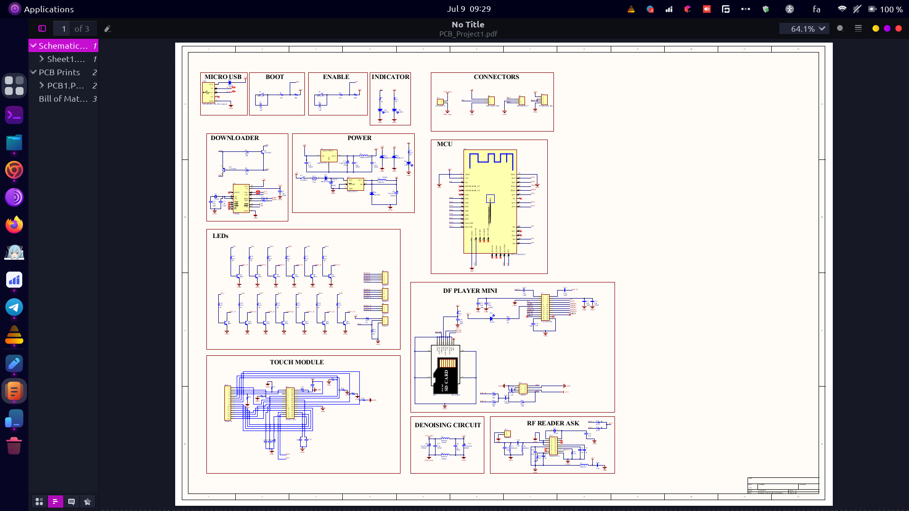
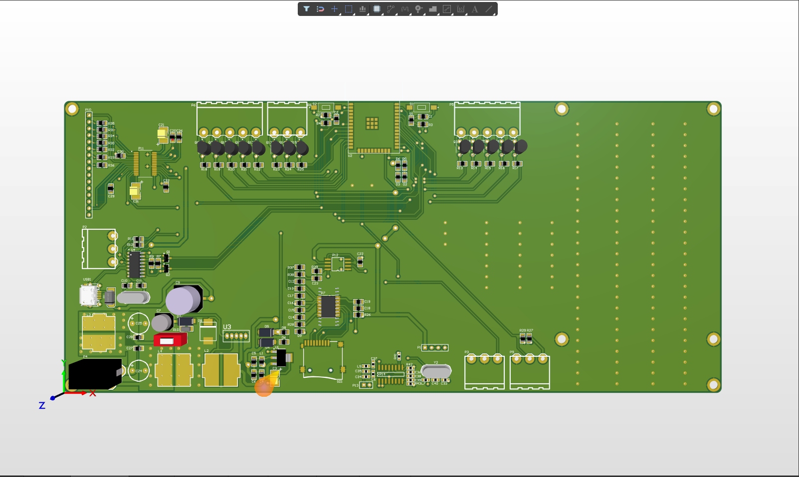

# Talking Skeleton with Bluetooth, RF, and MP3 Playback

## Features
- **Bluetooth Control:** Control the skeleton using a custom Android app.
- **RF Control:** Use an RF remote to trigger different actions.
- **MP3 Playback:** Play specific audio files stored on an SD card.
- **LED Indication:** Visual feedback through LEDs to indicate different parts of the skeleton.
- **Language Switching:** Switch between Persian and English for audio playback.

## Components
- **ESP32**
- **DFPlayer Mini MP3 Player**
- **Servos**
- **LEDs**
- **Bluetooth Module**
- **RF Receiver Module**
- **Custom PCB (Designed in Altium)**

## Schematic
Include a link or image of your schematic here.




## Hardware Setup
1. **ESP32:** Connect the ESP32 to your computer for programming.
2. **DFPlayer Mini MP3 Player:**
   - Connect the DFPlayer Mini to the ESP32 using UART pins.
   - Insert an SD card with the MP3 files into the DFPlayer Mini.
3. **LEDs and Servos:**
   - Connect LEDs to the designated GPIO pins on the ESP32.
   - Connect servos to the PWM pins on the ESP32.
4. **Bluetooth Module:**
   - Pair the Bluetooth module with the custom Android app.
5. **RF Receiver Module:**
   - Connect the RF receiver module to the ESP32.
6. **Power Supply:**
   - Provide appropriate power supply to all components.

## Software Setup

### Prerequisites
- Arduino IDE installed
- ESP32 board package installed in the Arduino IDE
- Required libraries: ESP32Servo, DFRobotDFPlayerMini, RCSwitch, BluetoothSerial

### Installation
1. **Clone the repository:**
   ```bash
   git clone https://github.com/esmail-sarhadi/talking-skeleton.git
   cd talking-skeleton
   ```

2. **Install Libraries:**
   - Install the necessary libraries in the Arduino IDE:
     - ESP32Servo
     - DFRobotDFPlayerMini
     - RCSwitch
     - BluetoothSerial

3. **Upload the code to the ESP32:**
   - Open the project in the Arduino IDE.
   - Connect your ESP32 to the computer.
   - Select the appropriate board and port.
   - Upload the code to your ESP32.

4. **Android App:**
   - Install the custom Android app on your device to control the skeleton via Bluetooth. (Provide link or APK file)
   - Pair your device with the skeleton.

## Usage

### Bluetooth Control
1. **Pairing:**
   - Open the Android app and pair it with the skeleton via Bluetooth.
2. **Control:**
   - Use the app to select different parts of the skeleton.
   - Trigger MP3 playback with corresponding LED indications.

### RF Control
1. **Using RF Remote:**
   - Use the RF remote to trigger specific actions.
   - The skeleton will play corresponding MP3 files and light up the relevant LEDs.

## Contributing
Feel free to contribute to this project by submitting issues or pull requests.

## License
This project is licensed under the MIT License - see the [LICENSE](LICENSE) file for details.

## Acknowledgments
- Inspiration and guidance from the maker community.
- Libraries used: ESP32Servo, DFRobotDFPlayerMini, RCSwitch, BluetoothSerial.
<h2 id="donation">Donation</h2>

<p>If you find this project helpful, consider making a donation:</p>
<p><a href="https://nowpayments.io/donation?api_key=REWCYVC-A1AMFK3-QNRS663-PKJSBD2&source=lk_donation&medium=referral" target="_blank">
     
</a></p>
